### GoLang_Authentication_Practise

Pre-Requisite:  
- Visual Studio Code   
- Install Go from https://go.dev/ 
- Postman app from https://www.postman.com/downloads/  

Check Go Configuaration using VS Terminal by running below commands  
- go --version  
- go env  

### Code Practises  
1) Marshal Sample -- Converting Objects to json  
2) Unmarshal Sample -- Converting json to objects  
3) Encode and Decode Sample Program  
4) Storingpassword Sample Program using bcrypt  
    #### for more password encryption golang examples  
    https://golang.hotexamples.com/examples/golang.org.x.crypto.scrypt/-/Key/golang-key-function-examples.html  
5) HMAC Sample - Hash Message Authentication Code (HMAC) as defined in U.S. Federal Information Processing Standards Publication 198. An HMAC is a cryptographic hash that uses a key to sign a message. The receiver verifies the hash by recomputing it using the same key.  
6) HMAC Sample 2- with Client Response and Saved Key in Cookie 
7) JWT - 
    #### JWT INTRO - https://github.com/golang-jwt/jwt  
    Hint:  
    type UserClaims struct { 
	jwt.StandardClaims 
	SessionID int64 
    } 
    after typing above code run go mod tidy and restart your VS to get the jwt intellisense.  

    to know more about JWT in GoLang visit https://learn.vonage.com/blog/2020/03/13/using-jwt-for-authentication-in-a-golang-application-dr/  

    for encode and decode jwt tokens vsiit https://jwt.io/  

    for uuid in goLang download package using go get github.com/gofrs/uuid
8) base64 encode-decode  
9) Crypto Sample  
10) Crypto Sample - Abstract encrypt writer function  

### Output Screenshots:
1) Marshal Sample  
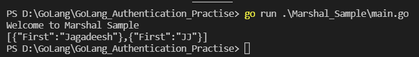 
2) UnMarshaling Sample  
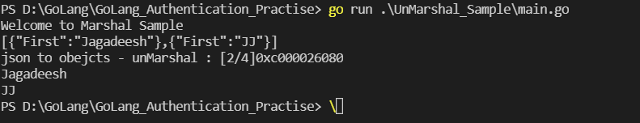 
3) Encode and Decode Sample Program  
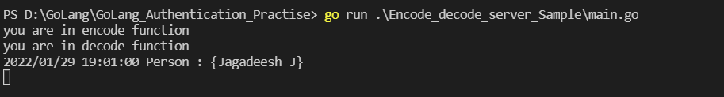 
Encode postman Request: 
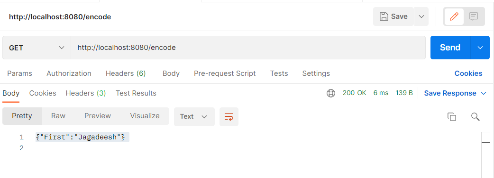 
Decode postman Request: 
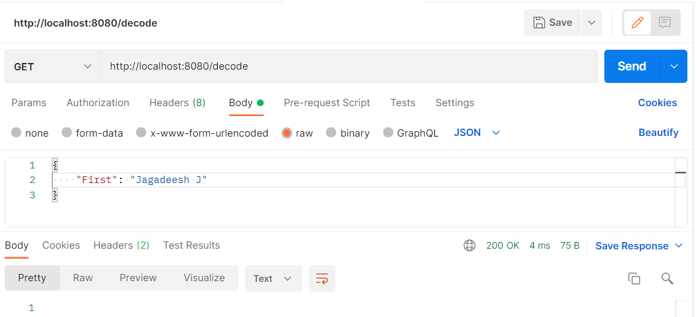 
4) Storingpassword Sample Program using bcrypt  
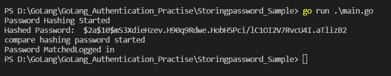 
5) HMAC Sample  
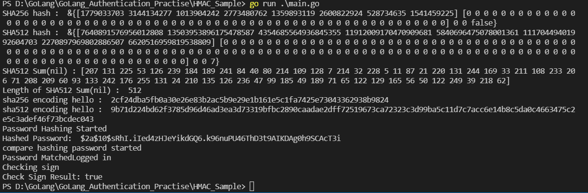 
6) HMAC Sample 2 
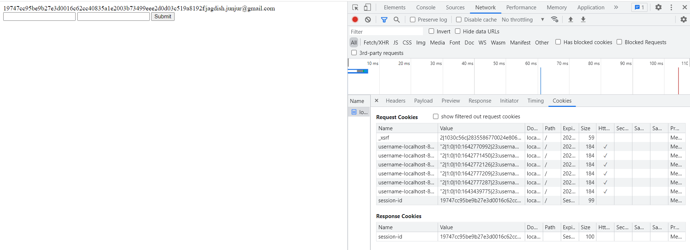 
7) JWT Sample  
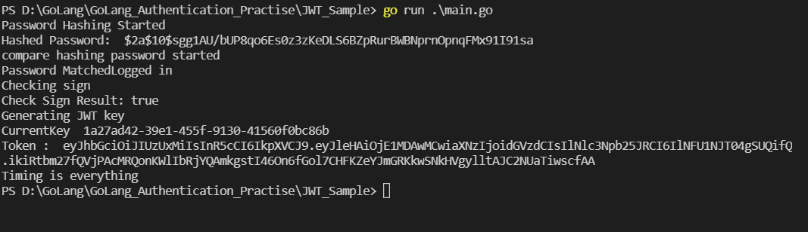 
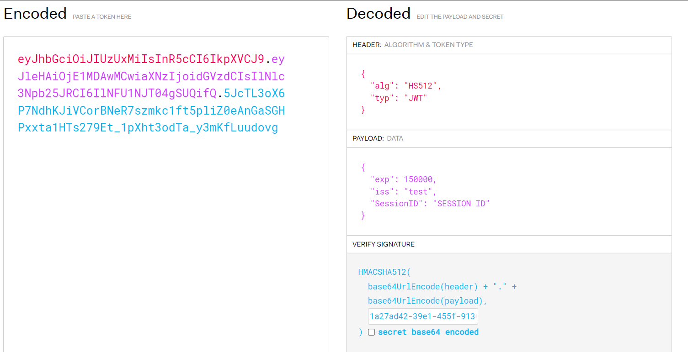 
8) base64 encode-decode  
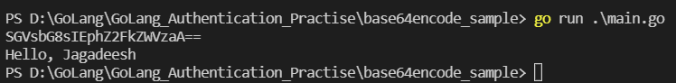 
9) Crypto Sample  
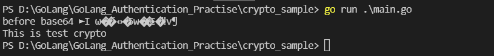 
10) Crypto Sample - Abstract encrypt writer function  
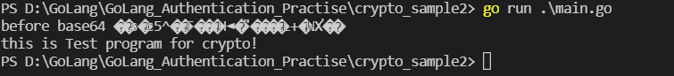 